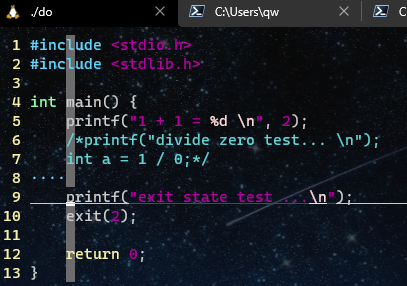

##  功能要求

实现以下功能： filename：do.c， 

- 可执⾏程序do 运⾏ ./do a.c 或 ./do a.cpp 

  - 如果 a.c 或 a.cpp ⽂件已经存在，则使⽤ vim 打开该⽂件 
  - 如果⽂件不存在，则新建该⽂件，且⽤ vim 打开 

- 当在 vim 中保存并退出的时候，⾃动编译该程序

  - 如果是 .c ⽂件使⽤ gcc 完成⾃动编译 
  - 如果是 .cpp 则使⽤ g++ 完成⾃动编译

- 如果对以上打开的⽂件编译成功，则直接执⾏编译后的可执⾏程序

- 如果失败，则直接退出

   

## 实验结果





### code

```c
#include <ctype.h>
#include <fcntl.h>
#include <stdio.h>
#include <stdlib.h>
#include <string.h>
#include <sys/stat.h>
#include <sys/types.h>
#include <sys/wait.h>
#include <unistd.h>

int main(int argc, char** argv) {
    if (argc < 2) {
        fprintf(stderr, "Usage: %s codefile\n", argv[0]);
        exit(1);
    }

    int fd = open(argv[1], O_RDONLY | O_CREAT, 0777);
    close(fd);

    int   state, state2;
    int   fnamelen = strlen(argv[1]);
    pid_t pid      = fork();
    if (pid < 0) {
        perror("fork");
        exit(1);
    }

    if (pid == 0) {
        execlp("vim", "vim", argv[1], NULL);
        perror("vim");
        exit(2);
    }
    else {
        wait(&state);
        if (state == 2) {
            perror("vim return");
            exit(3);
        }

        pid = fork();
        if (pid < 0) {
            perror("fork 2");
            exit(4);
        }

        if (pid == 0) {
            if (argv[1][fnamelen - 1] == 'c') {
                execlp("gcc", "gcc", argv[1], NULL);
                perror("gcc");
                exit(5);
            }
            else {
                execlp("g++", "g++", argv[1], NULL);
                perror("g++");
                exit(5);
            }
        }
        else {
            wait(&state2);
            if (state2 == 5) {
                perror("compile");
                exit(6);
            }
            execl("./a.out", "./a.out", NULL);
            perror("./a.out");
            exit(7);
        }
    }

    return 0;
}
```

