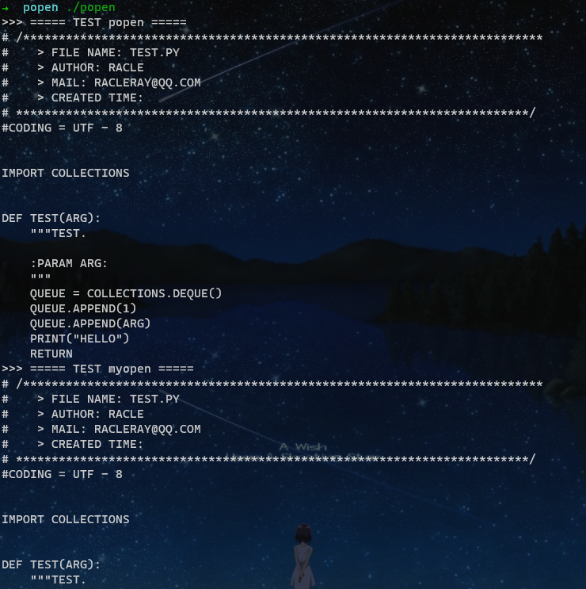
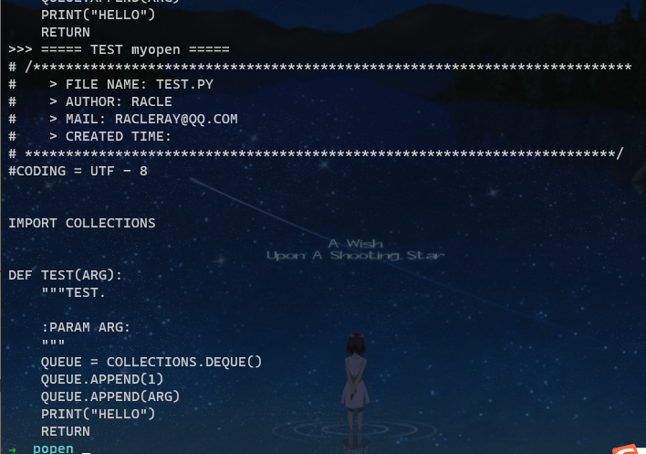

## 要求

实现⾃⼰的 popen(const char *cmd, const char *mode) 和 pclose(FILE *fp)

popen有以下⼏个细节 

1. pipe打开管道 
2. fork创建⼦进程
3. exec在⼦进程中实现 /bin/sh -c "cmd"
4. dup()复制标准IO流到管道

pclose有以下细节 

1. 使⽤wait等待⼦进程关闭 
2. ⼦进程与popen的返回值绑定，或者叫有关

## 实现

childpid 可以使用一个数组储存，liunx库实现就是数组。

popen的 r 和 w 的动作接受者是 cmd 的进程，r 表示 cmd 从管道读，所以管道保持写端。w 表示 cmd 往管道中写，管道保持读端。