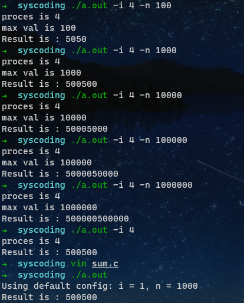

## 功能要求

实现从数字1到数字N的累加

> filename ： sum.c，可执⾏程序
>
> sum Usage： ./sum -i 5 -n 10000 ： 表⽰使⽤5个进程，计算从1加到10000的和 
>
> Result：1+2+3+..+10000 = ? 

1. 每个进程都参与计算 
2. 不能对业务进⾏拆分 
3. 每个进程都去抢着加 
4. 不能使⽤任何睡眠策略 
5. 不能规定进程的执⾏顺序

## 运行效果




### code

```c
#include <fcntl.h>
#include <stdio.h>
#include <stdlib.h>
#include <string.h>
#include <sys/file.h>
#include <sys/stat.h>
#include <sys/types.h>
#include <unistd.h>
#include <wait.h>

#define BUFLEN 100

int main(int argc, char** argv) {
    int       opt, nproc = 1;
    long long maxval = 1000;
    long long res = 0, curval = 0;
    char      buf[BUFLEN] = {0};
    while ((opt = getopt(argc, argv, "i:n:")) != -1) {
        switch (opt) {
        case 'i':
            nproc = atoi(optarg);
            printf("proces is %d \n", nproc);
            break;
        case 'n':
            maxval = atol(optarg);
            printf("max val is %lld \n", maxval);
            break;
        default:
            fprintf(stderr, "Usage: %s -i [process] -n [limit]\n", argv[0]);
            exit(1);
        }
    }
    if (argc == 1) {
        printf("Using default config: i = 1, n = 1000\n");
    }

    // create a new file for IPC
    pid_t pid;
    int   fd = open("./fileipc", O_RDWR | O_CREAT | O_TRUNC, 0666);
    if (fd < 0) {
        perror("open");
        exit(1);
    }
    write(fd, "0 1", BUFLEN);

    // fork for multi-process
    for (int i = 1; i <= nproc; i++) {
        pid = fork();
        if (pid < 0) {
            perror("fork");
            exit(1);
        }
        if (!pid) break;
    }

    // parent main process logic
    if (pid) {
        for (int i = 0; i < nproc; i++) {
            waitpid(0, NULL, 0);
        }
        lseek(fd, 0, SEEK_SET);
        if (read(fd, buf, BUFLEN) < 0) {
            perror("read");
            exit(1);
        }

        sscanf(buf, "%lld %lld", &res, &curval);
        printf("Result is : %lld\n", res);

        close(fd);
    }
    // child process logic using file lock IPC
    else {
        close(fd);
        fd = open("./fileipc", O_RDWR);
        while (1) {
            if (flock(fd, LOCK_EX) != 0) {
                perror("flock");
                exit(2);
            }

            lseek(fd, 0, SEEK_SET);
            if (read(fd, buf, BUFLEN) < 0) {
                perror("read");
                exit(1);
            }
            sscanf(buf, "%lld %lld", &res, &curval);

            if (curval > maxval) {
                close(fd);
                exit(0);
            }

            res += curval;
            ++curval;
            sprintf(buf, "%lld %lld", res, curval);

            lseek(fd, 0, SEEK_SET);
            if (write(fd, buf, BUFLEN) < 0) {
                perror("write");
                exit(1);
            }

            if (flock(fd, LOCK_UN) < 0) {
                perror("flock unlock");
                exit(1);
            }
        }
    }

    return 0;
}
```

