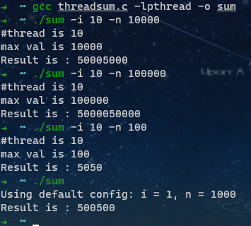

## 功能要求

实现从数字1到数字N的累加

> filename ： sum.c，可执⾏程序
>
> sum Usage： ./sum -i 5 -n 10000 ： 表⽰使⽤5个线程，计算从1加到10000的和 
>
> Result：1+2+3+..+10000 = ? 

1. 每个线程都参与计算 
2. 不能对业务进⾏拆分 
3. 每个线程都去抢着加 
4. 不能使⽤任何睡眠策略 
5. 不能规定线程的执⾏顺序

## 运行效果

